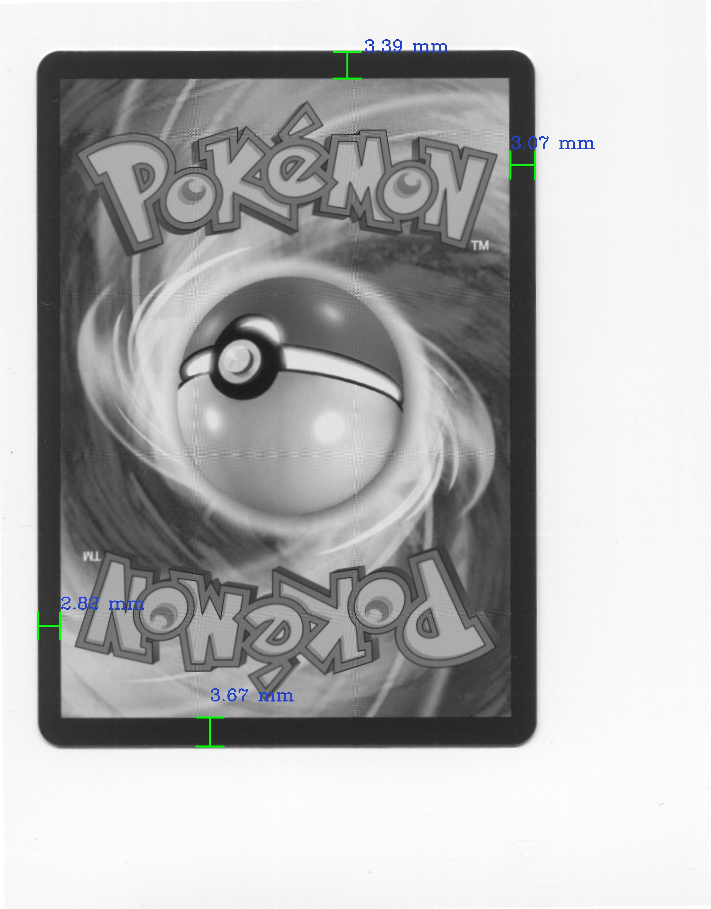
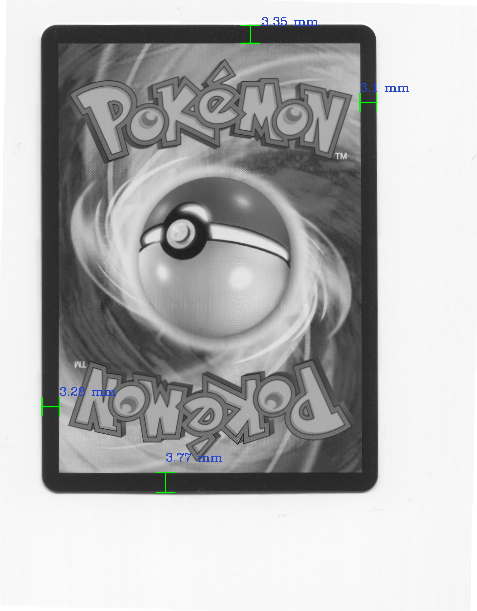
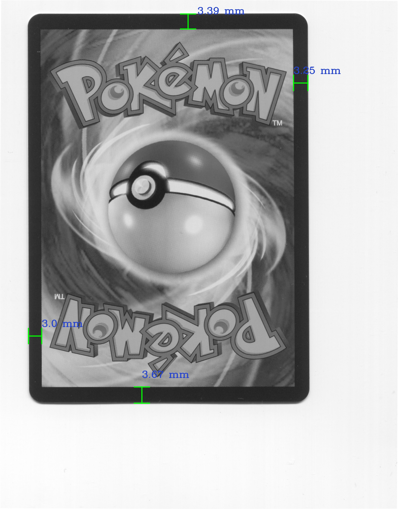
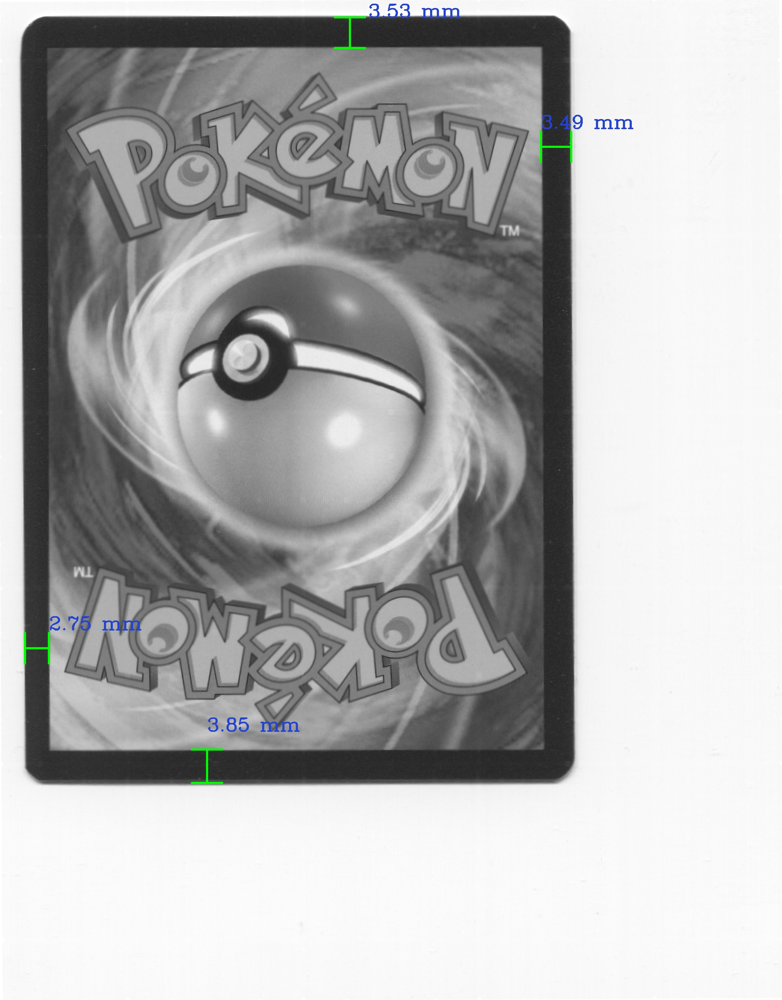
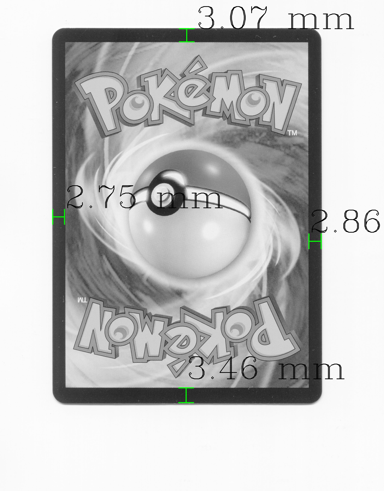

## Descriptions

Pokemon cards have become very popular in recent years. A single card can cost thousands of dollars. One of the factors that affect a card's cost is its distance from the outer border to the inner border. Manually measuring it can be very time consuming. Using this program, Pokemon cards can be automatically measured. This program can save you a tremendous amount of time for the measurement.

## Server user's manual

These are the commands you can use to control the program through a socket server side.

- **RUN**: to run the card detection app
- **FORCE STOP**: to forcefully stop the card detection app
- **RESULTS**: to get the current results generated by the card detection app
- **CURRENT**: to get the current running card status by the card detection app
- **STOP SERVER**: to fully stop the server and all running processes

## Sample inputs

	
	
	
	
	

## Sample outputs

	
	
	
	
	

