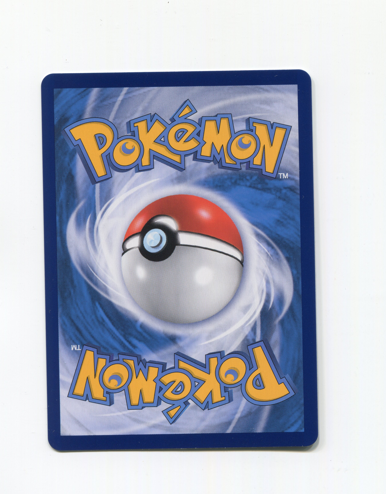
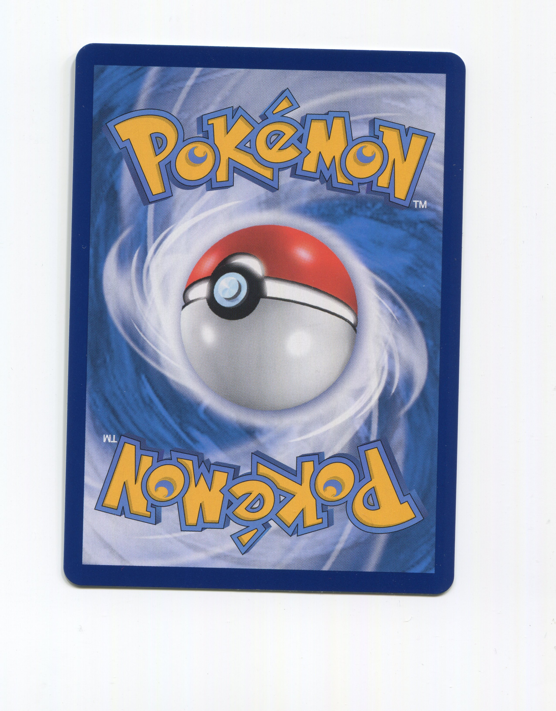
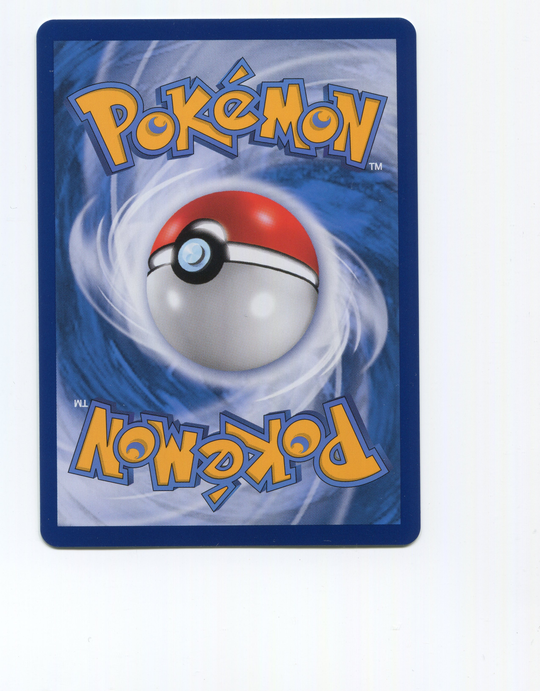
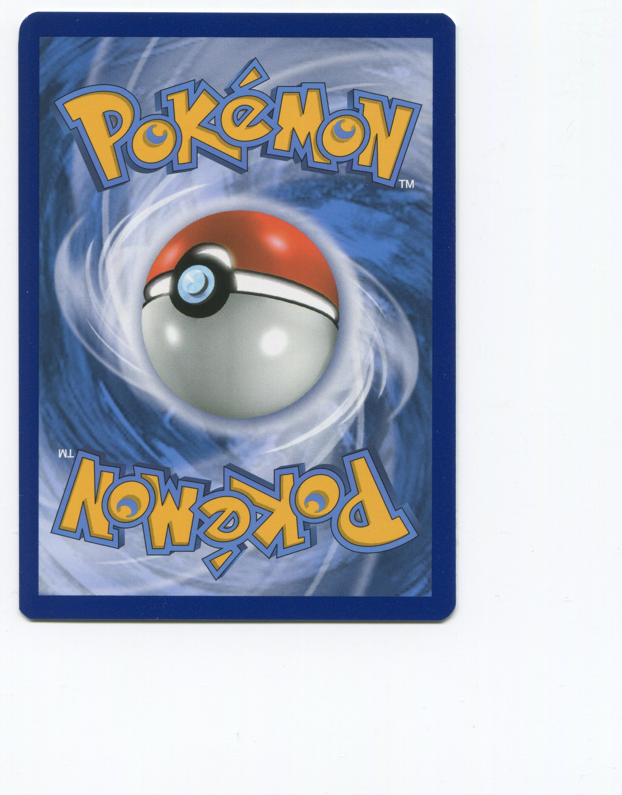

## Descriptions

Pokemon cards have become very popular in recent years. A single card can cost thousands of dollars. One of the factors that affect a card's cost is its distance from the outer border to the inner border. Manually measuring it can be very time consuming. Using this program, Pokemon cards can be automatically measured. This program can save you a tremendous amount of time.

## Sample inputs

## Sample outputs

 